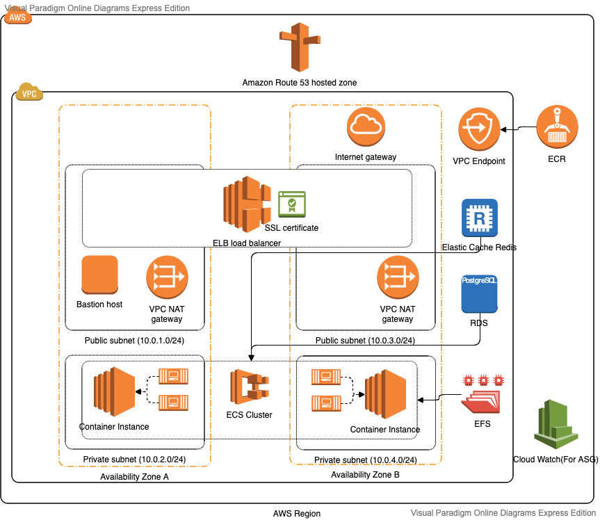

### What is this for
This is cloudformation to deploy the CVAT labeling tool into ECS
Apart from the normal ECS, it also creates the following AWS resources:
  - RDS(`Postgres`)
  - Elasticache(`Redis`)
  - EFS
  - ECR
  - A bastion instance
  - Cloudwatch for ECS ASGs

Stack names:
  - `cvat-test` for test
  - `cvat-prod` for prod

### Why not fargate
The app requires shared folders to store the image. By the time we build the solution, AWS hadn't released
the support the EFS in Fargate. However, as of 18th Jan 2020, they released the preview support of EFS in
Fargate(https://docs.aws.amazon.com/AmazonECS/latest/APIReference/API_EFSVolumeConfiguration.html)
We should consider move to Fargate when this feature is released.

### Architect diagram


### Notes
Only deploy `deploy` branch

### Production super user credentials

You can find the credentials in AWS Parameter Store
  - `/datarock/cvat/superuser/username`
  - `/datarock/cvat/superuser/password`

### Before first deployment
  - Create Keypairs
    - `ecs-keypair` for test
    - `ecs-prod-keypair` for prod
  - SSM parameters
    ```
    aws ssm put-parameter --name "/datarock/cvat/dbpassword" --value "verygoodpasswordhere" --type "String" --overwrite
    ```
  - Run
    ```
    deploy/bin/run-before-first-deploy.sh
    ```
  - Change the EFS permissions
    EFS is automatically mapped to all the ECS instances. However, we may have to make it readable/writable for all users.
    - SSH to the `bastion` instance.
      You can find the bastion ASG(named: `...CfnBastionStack...`) in AWS console Auto Scaling Groups.
      Modify the `Desired Capacity` to 1 will initialise the instance. The keypairs are:
        - `ecs-prod-keypair` for production
        - `ecs-keypair` for test
    - From `bastion`, SSH to the Container Instance with the same keypair
    - In the Container instance, run the following command to change the mounted efs folder access rights
      ```
      sudo chmod 777 -R /mnt/efs
      sudo chmod 777 -R /mnt/efs/*
      sudo chmod 777 -R /mnt/efs/*/*
      ```
### How to deploy
```
deploy/bin/deploy.sh
```
### Admin panel
For Production goto
  - https://label.datarock.com.au:8443/admin
For Test goto
  - https://label-test.datarock.com.au:8443/admin